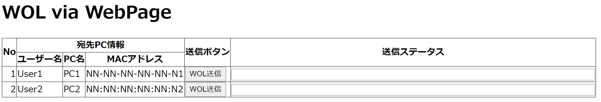

# WOLviaWebpage

WOLを発行するWebページを以下のように表示する。
LAN内で動かす前提であり、ルーター越えは考慮しない。



## Depencency

- [Node.js](https://nodejs.org/en/) 任意のバージョン
- [json5](https://www.npmjs.com/package/json5) v2.2.0 以上
- [wake_on_lan](https://www.npmjs.com/package/wake_on_lan) v1.1.0以上

## Setup

ソースコードをダウンロードし、任意のフォルダに配置する。

## Usage

まず、MacAddressList.json5を編集し、以下のフォーマットでmacAddressListへ情報を記載する。MACアドレスの区切り文字は「-」、または「:」のどちらでもよい（区切り文字なしでもよい。）

```javascript
{
  macAddressList: [
    { userName:'User1', pcName:'PC1', macAddress:'NN-NN-NN-NN-NN-NN' },
    { userName:'User2', pcName:'PC2', macAddress:'NN:NN:NN:NN:NN:NN' },
  ]
}
```

次に、Node.jsでWOLviaWebpage.jsを実行する。

```cmd
node WOLviaWebpage.js
```

そして、WOLviaWegpage.jsを実行しているPCのIPアドレスに対し、ブラウザからhttp、かつポート3000でアクセスする。

```text
http://IPアドレス:3000
```

すると、MacAddressList.json5に記載したMACアドレスに対してWOLを発行するWebページを表示するので、起動したいPCに対してWOL送信ボタンを押下する。

## License

- [WOLviaWebpage](https://github.com/DNV825/WOLviaWebpage), [WTFPL-2.0](http://www.wtfpl.net/)

```text
        DO WHAT THE FUCK YOU WANT TO PUBLIC LICENSE 
                    Version 2, December 2004 

 Copyright (C) 2004 Sam Hocevar <sam@hocevar.net> 

 Everyone is permitted to copy and distribute verbatim or modified 
 copies of this license document, and changing it is allowed as long 
 as the name is changed. 

            DO WHAT THE FUCK YOU WANT TO PUBLIC LICENSE 
   TERMS AND CONDITIONS FOR COPYING, DISTRIBUTION AND MODIFICATION 

  0. You just DO WHAT THE FUCK YOU WANT TO.
```

- [json5](https://www.npmjs.com/package/json5), [MIT Lisence](https://github.com/json5/json5/blob/HEAD/LICENSE.md)
- [wake_on_lan](https://www.npmjs.com/package/wake_on_lan), [MIT Lisence](https://www.npmjs.com/package/wake_on_lan#license-mit)

## Authors

- [WOLviaWebpage](https://github.com/DNV825/WOLviaWebpage), DNV825
- [json5](https://www.npmjs.com/package/json5), Assem Kishore / Michael Bolin / Douglas Crockford / Max Nanasy / Andrew Eisenberg / Jordan Tucker
- [wake_on_lan](https://www.npmjs.com/package/wake_on_lan), Jann Horn @thejh / mh-cbon @mh-cbon

## References

1. @niusounds, Node.jsでブロードキャストアドレスを取得する, Qiita, 2017/08/18, <https://qiita.com/niusounds/items/712770e79888f4235637>
1. taikiken, node.js local IP アドレスを取得したい, イナヅマTVログ, 2015/04/16, <http://www.inazumatv.com/contents/archives/9885>
1. からあげ (id:karaage) , READMEの良さそうな書き方・テンプレート【GitHub/Bitbucket】, からあげ, 2018/01/19, <https://karaage.hatenadiary.jp/entry/2018/01/19/073000>
1. matiassingers, Awesome README, github.com, 2020/02/28, <https://github.com/matiassingers/awesome-readme>
